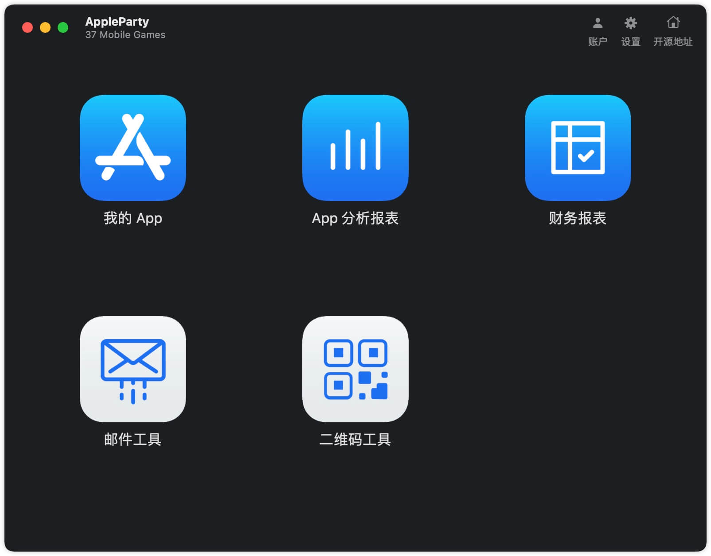
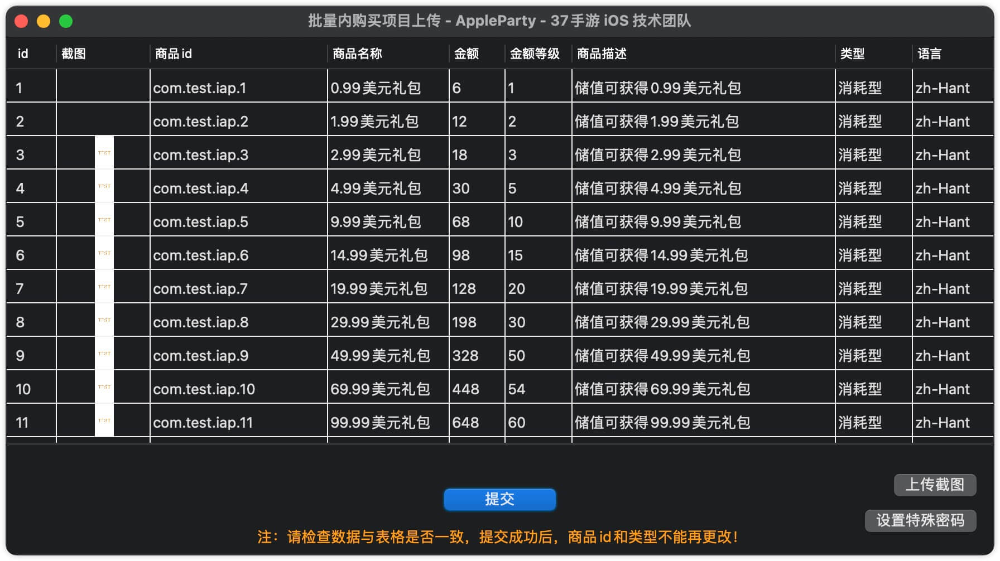
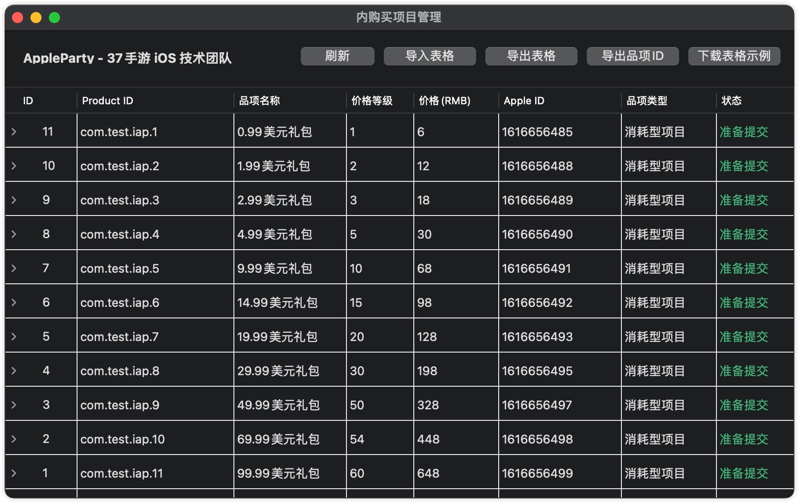
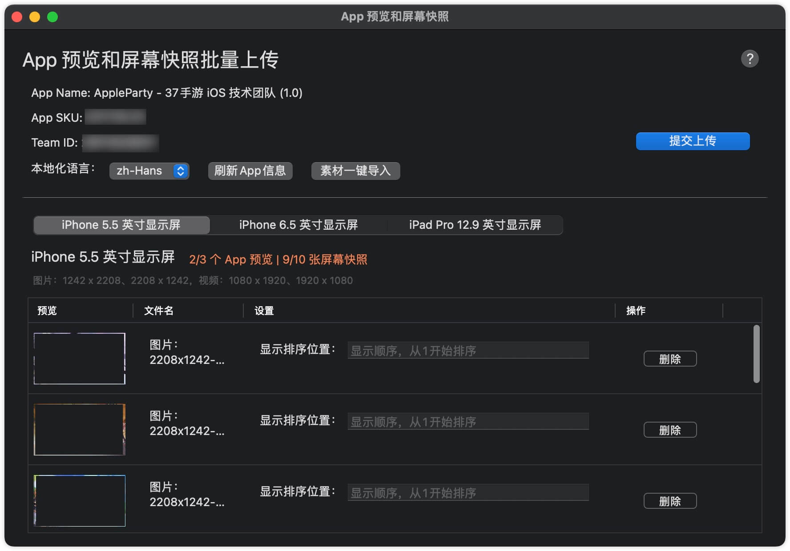
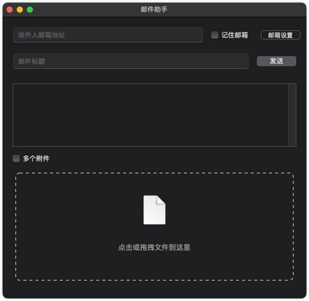

## Apple Party（苹果派）


###  一、App 介绍

AppleParty 是三七互娱旗下37手游 iOS 团队研发，实现快速操作 App Store Connect 后台的自动化 macOS 工具。


- 使用和原理介绍：[开源一款苹果 macOS 工具 - AppleParty（苹果派）](https://juejin.cn/post/7081069026515877919)


**支持功能**

- 内购买项目管理（批量创建和更新）；
- 批量商店图和预览视频上传和更新；
- 邮件发送工具；
- 二维码扫描和生成工具；

> 注：内购买项目和商店素材上传，暂时只支持 iOS app，未来会考虑支持 macOS app、tvOS app。

**TODO**

- 数据报表下载；
- 元数据管理；
- 开发证书管理；
- 更多功能，敬请期待~


### 二、项目背景

目前，iOS/macOS App 上架 App Store，与苹果打交道的唯一方式，就是登陆苹果 App Store Connect 后台（[https://appstoreconnect.apple.com](https://appstoreconnect.apple.com)，通过苹果后台进行 App 所有的信息和素材等送审准备工作。但是，目前苹果后台的自动化水平还处于零基础，很多重复的操作和功能，都没有提供批量处理方案，比如：

- 商店截图和预览视频的上传
- 应用内购商品的创建和更新
- App 本地化的元数据信息配置
- ...


App 分析的指标：

- 展示次数
- 产品页面查看次数
- 首次下载次数
- 净预订量
- 平台版本（iOS14.5、iOS15...)
- 页面类型（产品页面、商店表单、App内活动...）
- 用户来源（网页引荐来源、App 引荐来源、AppStore 浏览、AppStore 搜索、活动通知...）
- ...

以上的 App 分析数据，每次只能下载一个指标的数据，每个 App 有十几个指标，操作这些重复的配置往往占用了运营同学非常长的时间，效率低且重复无聊的工作，导致我们长期无法做更多的时间开启和享受创造性。

基于以上种种痛点，我们从多个技术手段，打造了 Apple Party（苹果派对）工具! 通过尽可能快速实现操作的自动化流程，从而大大提高苹果后台的操作效率！


**Apple Party（苹果派）**

我们倡导工作之余，丰富多彩的生活要领，健身、旅游、聚会、培养艺术兴趣等等。

- Party：派对 即 “宴会，聚会” 的意思，大家聚在一起庆祝和休闲的一种活动。

所以，Apple Party（苹果派对），简称：**苹果派**，就是希望大家在使用苹果的服务时，像似参加一场苹果派对，尽情欢乐，欢聚宴会~


###  二、使用说明

#### 下载安装包

- [Releases](https://github.com/37iOS/AppleParty/releases)


**update 更新**

项目使用 Sparkle 来更新，重启就会自动检查更新。也可以手动检查更新。


#### 手动构建
**build 构建**

在项目主目录下，执行安装依赖库命令：
```
pod install
```

然后双击 `AppleParty.xcworkspace` 打开项目构建。


> 项目依赖 Swift Package，Xcode 可能下载失败，可以清理缓存试试： 打开 Xcode File -> Packages ->  Reset Package Caches

### 效果示例







### 特别感谢

- [Alamofire/Alamofire](https://github.com/Alamofire/Alamofire)
- [Kitura/Swift-SMTP](https://github.com/Kitura/Swift-SMTP)
- [SnapKit/SnapKit](https://github.com/SnapKit/SnapKit)
- [sparkle-project/Sparkle](https://github.com/sparkle-project/Sparkle)
- [tid-kijyun/Kanna](https://github.com/tid-kijyun/Kanna)
- [drmohundro/SWXMLHash](https://github.com/drmohundro/SWXMLHash)
- [jdg/MBProgressHUD](https://github.com/jdg/MBProgressHUD)
- [joshuajylin/MBProgressHUD-macOS](https://github.com/joshuajylin/MBProgressHUD-macOS)
- [Yueoaix/SymbolicatorX](https://github.com/Yueoaix/SymbolicatorX)
- [fpotter/ExpandingDatePicker](https://github.com/fpotter/ExpandingDatePicker)
- [kishikawakatsumi/KeychainAccess](https://github.com/kishikawakatsumi/KeychainAccess)
  

